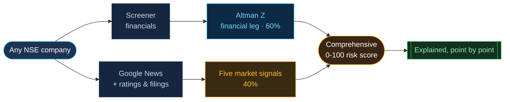
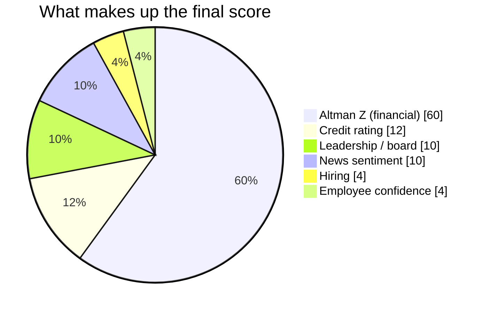

<p align="center">
  
</p>

<p align="center">
  
  
  
  
  
</p>

<h3 align="center">See corporate distress before the annual accounts admit it.</h3>

<p align="center"><b>Foresight AI</b> turns any listed Indian company into a single, explainable <b>0-100 risk score</b> - the classic Altman Z-Score fused with the market signals that move <i>before</i> the books do: credit ratings, leadership changes, news, hiring and employee sentiment.</p>

<p align="center">
  <a href="https://foresightai.streamlit.app"><b>▶&nbsp; Open the live app</b></a> &nbsp;·&nbsp; <code>streamlit run app/main.py</code>
</p>

> Altman tells you what the balance sheet already knows. **Foresight AI tells you what deserves your attention _now_.**

---

## Why it exists

Distress is rarely a surprise - the warning signs are public for months. But today they are:

- **Backward-looking** - financial statements update once a year.
- **Scattered** - a rating cut here, an auditor exit there, a board resignation somewhere else.
- **Manual** - analysts read filings one company at a time.

Financial-only models like Altman Z are trusted but blind to everything that has not yet hit the accounts. **Unitech read "Safe" on Altman for years while its promoters were being arrested. Future Retail scored Safe the year before it defaulted.** Foresight AI closes that gap.

## What you get - a four-tab dashboard

| Tab | What it does |
|-----|--------------|
| **Overview** | What the score is, why it exists, and exactly how it is built. |
| **Live Company Scoring** | Pick any NSE company. Six tracked names carry the full five-signal pulse; any other is fetched and scored live from Screener + Google News. |
| **Portfolio** | Build your own watch-list - add or remove any company, ranked worst-risk first. |
| **Track Record** | The proof. Real collapses replayed on real history, with the Altman financial base and the *added* signal risk stacked into one comprehensive score. |

### One live pipeline, nothing hard-coded



## How the score is built

**One number, two legs, always explainable.**

```
Comprehensive risk  =  0.60 x  Altman Z (financial)   +   0.40 x  Market-signal pulse
```

The market-signal pulse, weighted by how much you can trust each source:

| Signal | Weight | Reads |
|--------|:------:|-------|
| Credit rating | 0.30 | rating actions (CRISIL / ICRA / CARE / S&P) |
| Leadership / board | 0.25 | dated filings, incl. auditor exits |
| News sentiment | 0.25 | live Google News, distress-keyword scored |
| Hiring trend | 0.10 | reported headcount |
| Employee confidence | 0.10 | review-platform ratings |



A **hard event** - a rating cut to default, an auditor walking out, a tribunal taking over the board - is a fact, not a mood: it *floors* the score and cannot be averaged away by softer signals. Every point traces back to a real ratio, rating or headline.

## The proof (Track Record)

Five real failures, five sectors, each scored on its own historical financials from Screener - with the amber band showing the risk Altman alone could not see:

| Company | Sector | The story the chart tells |
|---------|--------|---------------------------|
| **Unitech** | Real Estate | Altman "Safe" until 2021; the signals were loud from 2015 |
| **Future Retail** | Retail | Altman "Safe" in FY2019, defaulted 2022 |
| **Reliance Communications** | Telecom | financial and market signals agree - a clean collapse |
| **Jaiprakash Associates** | Infrastructure | Altman swings; the comprehensive score stays clear |
| **Suzlon** | Renewables | it also reads *recovery* - the score falls before the accounts confirm it |

## The honest pitch

We do **not** claim to beat Altman - the financial engine *is* Altman. The value is making it **live, comprehensive, explainable, and validated on real history** - and one mechanism that is genuinely ours: a **hard-event floor**, where a default, an auditor exit or a tribunal taking over the board sets a risk floor that softer signals cannot average away, the way a credit desk treats a verified fact. We tested trained models too (see the notebooks): foreign bankruptcy data does not transfer to Indian balance sheets, and an India-trained model *matches* the formula rather than beating it - which is exactly why the trusted linear Altman score stays the anchor.

## Under the hood

```
src/foresight.py       the engine - Altman Z, the five signals, fusion, stress test, benchmarks
src/screener_live.py   live financials + market cap from Screener
src/live_news.py       live news sentiment from Google News (no API key)
app/                   the Streamlit dashboard (main.py, scoring_service.py, theme.py)
data/indian/           scraped Indian training set + NCLT labels + the historical backtest
notebooks/             the model-building and evaluation story
deck/                  the 5-slide pitch deck
REPORT.md              the formal project report
```

**Quickstart**

```bash
pip install -r requirements.txt
streamlit run app/main.py
```

A clean clone runs the whole app with nothing extra - the score is computed live, not loaded from a saved model. The `notebooks/` rebuild the ML benchmark from scratch (the UCI Polish set downloads on first run); the model comparison lives in `data/indian/README.md`.

## Scope

A decision-support tool, not a substitute for professional analysis. It uses public data (Screener, Google News) fetched live; a production build would swap in licensed feeds. Share-price lines in Track Record are annual closes, indexed - direction, not tick data.
