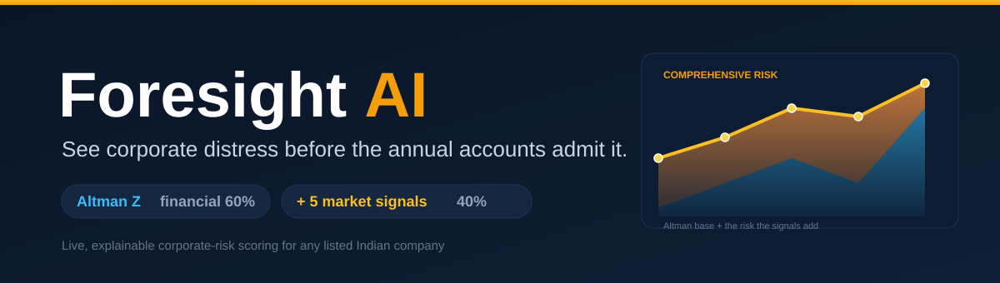
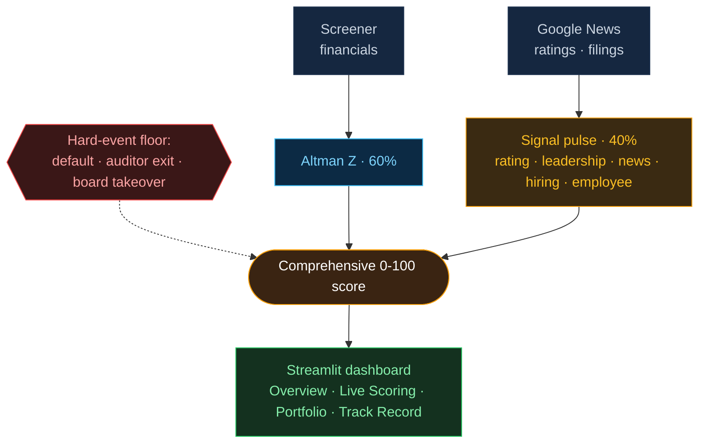

  

<h1 align="center">Project Report</h1>

  
  
  
  

<b>A live, comprehensive corporate-risk engine for listed Indian companies.</b> 
Live app: <a href="https://foresightai.streamlit.app">foresightai.streamlit.app</a> &nbsp;·&nbsp; Code: <a href="https://github.com/hiralsarkar/ForesightAI">github.com/hiralsarkar/ForesightAI</a>

---

## 1. Problem Statement

Credit and investment desks need to know **which companies are heading for distress - early enough to act.** Today that judgement is:

- **Backward-looking.** Financial statements update once a year. By the time the ratios turn, the collapse is often already public.
- **Scattered.** The warning signs - a rating downgrade, an auditor resignation, a board exit, a run of negative news - each land in a different place, and nobody joins them up in time.
- **Manual.** Analysts read filings one company at a time, so the slowest, riskiest names get watched last.

Classic distress models such as the **Altman Z-Score** are trusted but **financial-only**: they score the balance sheet and miss everything that has not yet hit the accounts. The result is a real gap - companies like **Unitech** read "Safe" on Altman for years while their promoters were being arrested, and **Future Retail** scored Safe in FY2019 while its debt and control crisis was already public - years before its 2022 insolvency.

**The problem:** give any listed company a single, explainable risk score that combines the financial picture with the market signals that move before the accounts do.

## 2. Overall Solution Approach

Foresight AI produces **one 0-100 risk score** for any NSE-listed company, on demand, and explains every point.

**Two legs, fused.**
- **Financial leg (60%)** - the original 1968 **Altman Z-Score**, all five components, using the live market value of equity for listed firms. Computed live and decomposed term by term.
- **Market-signals leg (40%)** - a five-signal "digital pulse", weighted by reliability:
  | Signal | Weight (of digital) | Source |
  |---|---|---|
  | Credit rating | 0.30 | Curated rating actions (CRISIL/ICRA/CARE/S&P) |
  | Leadership / board changes | 0.25 | Dated public filings (incl. auditor exits) |
  | News sentiment | 0.25 | Live Google News + distress-keyword lexicon |
  | Hiring trend | 0.10 | Reported headcount |
  | Employee confidence | 0.10 | Employee-review platform ratings |

**Hard-event floors.** A verified fact - a rating cut to default, an auditor resignation, a tribunal displacing the board - cannot be averaged away by softer signals; it floors the score. This is standard credit practice and prevents news-tone models from mislabelling a company in insolvency as "positive".

**Explainability throughout.** Every score decomposes into its Altman terms and its signal readings, each with a plain-English reason.

**The product - a four-tab dashboard (Streamlit):**
1. **Overview** - what the score is and how it is built.
2. **Live Company Scoring** - pick any NSE company; six tracked names carry the full five-signal pulse, any other is fetched and scored live (financials + news).
3. **Portfolio** - a watch-list you build; add/remove any company, ranked worst-risk first.
4. **Track Record** - the validation view: real companies replayed on their real history, with the Altman financial-only risk (blue) and the extra risk the signals add (amber) stacked into the comprehensive score.

**Architecture:** `src/foresight.py` (the shipped engine: Altman, signals, fusion, stress test), `src/screener_live.py` + `src/live_news.py` (live data), `app/` (dashboard), `research/modeling.py` (the ML benchmark, tuning and explainability - used only by the notebooks), `data/` (training + backtest), `notebooks/` (model-building and evaluation).

**System architecture**

## 3. Key Findings

*Every number below is reproducible from `notebooks/04_findings.ipynb`.*

- **On a real control group the score separates the failures from the survivors.** Across 21 Indian companies - 12 financially healthy blue-chips (IT, FMCG, autos, metals) and 9 that went to NCLT or default - the shipped India logistic gives the failures a median distress probability of **0.83** against **0.13** for the healthy set. A cut-off that flags **none** of the 12 healthy firms still catches **8 of the 9** that failed (leave-one-out ROC-AUC **0.97**; PR-AUC 0.97 - both round to 0.9722 on this small, clean set, so the figure is optimistic and stated as such).
- **The financial-only blind spot, quantified.** Replayed on each company's own history, the comprehensive score crossed into high risk a **median 27 months before insolvency** - a median **6 months earlier** than Altman crossing the same threshold. The clearest case is **Unitech**: Altman never entered high risk until 2023, *three years after* the Supreme Court had already displaced the board, while the comprehensive score flagged it **26 months before** the January-2020 takeover. (Reconstructed on curated trajectories; the out-of-sample evidence is the control-group result above.)
- **The hard-event floor is a real safeguard, and it binds.** On **SpiceJet** the verified auditor exit floors the digital pulse to **78** even though its softer signals average **76**; historically it stopped **Reliance Communications'** board-suspension reading (**96**) from being averaged down to "Elevated" by news that a tone model read as *positive* during the insolvency. It is a safeguard for when signals disagree - not an always-on lever, and it changes nothing on the healthy names.
- **The blend is robust to its weights.** The worst-to-best risk ordering of the six tracked companies is **identical at 50/50, 60/40 and 70/30**, so the exact 60/40 split is not load-bearing - the ranking is driven by the signals, not the weighting.
- **The ML lift is real but does not transfer.** On the UCI Polish benchmark a 50-trial Optuna-tuned LightGBM reaches ROC-AUC 0.975 and Brier 0.013 (sigmoid-calibrated, 1,406-firm holdout) - roughly **4x** the catch rate of an Altman-style cut-off at a 1% review budget. But the same approach trained on Polish or Taiwanese data does **not** generalise to Indian balance sheets, and an India-trained model only **matches** Altman rather than beating it - which is exactly why the shipped scorer keeps the trusted linear Altman score as its anchor, not a black-box replacement.
- **Honest positioning holds.** We do not claim to beat Altman - the financial engine *is* Altman. The value is **comprehensive, live, explainable scoring plus historical validation**, not a magic number. Live data is feasible without paid feeds: financials (Screener) and news (Google News RSS) are fetched at runtime with no API key; a production build would swap in licensed feeds.

## 4. Further Improvement Areas / Next Steps

- **Widen live signals.** Extend the full five-signal pulse (currently curated for six tracked names) to any company via live feeds - especially a structured credit-rating source and an auditor-exit feed.
- **More validation cases.** Grow the Track Record set and the India training set (currently 21 firms + NCLT labels).
- **New signal classes (roadmap, not yet in the live score).** ESG controversies, macroeconomic overlays (today only a stress-test lever), and an ML distress-probability model (today a benchmark, not the scorer).
- **Heavier NLP.** FinBERT for news sentiment (currently a robust lexicon) once cloud cost/latency allow.
- **Reliability.** Confirm Screener and Google News fetch cleanly from Streamlit Cloud IPs; add caching/fallbacks.

## 5. Justification of the Overall Project

- **It answers a real, expensive question** - early, comprehensive distress detection - that financial-only tools address only partially.
- **It is defensible.** The financial leg is the peer-reviewed Altman Z; the signals are dated, public facts; hard events floor the score the way a credit desk would treat them. Nothing is a black box.
- **It is validated on real outcomes** across five sectors (real estate, retail, telecom, infrastructure, renewables), including a recovery case, using each company's own historical financials from Screener.
- **It is honest.** It does not overclaim: the added value is breadth and explainability, and the report states plainly where data is curated, indexed, or reconstructed.

---

## Deliverables

| Requirement | Where |
|---|---|
| **Presentation (5-6 slides)** | `deck/ForesightAI.pptx` (6 slides, incl. a measured Key Findings slide; a clickable live-app link on the last slide) |
| **Dataset** | `data/indian/` (`companies.csv` - 21 firms, hand-labelled from public insolvency/default outcomes; `nclt_cases.csv` - the public NCLT case register used as labelling reference; see `data/indian/README.md`), the UCI Polish bankruptcy benchmark (place UCI id 365 in `data/raw/` once), plus **live** Screener financials and Google News |
| **Codes** | `src/` (engine + live data), `app/` (dashboard), `notebooks/` (model building & evaluation) |

**Run locally:** `streamlit run app/main.py`

## Current status

- **Code:** complete and running; four-tab dashboard, five-signal fusion, Track Record validation, editable portfolio. Verified locally with no errors.
- **Deployment:** the Streamlit Cloud app auto-redeploys on each push and is live at [foresightai.streamlit.app](https://foresightai.streamlit.app).
- **Deck:** regenerated to the comprehensiveness story with a working live-dashboard hyperlink.
