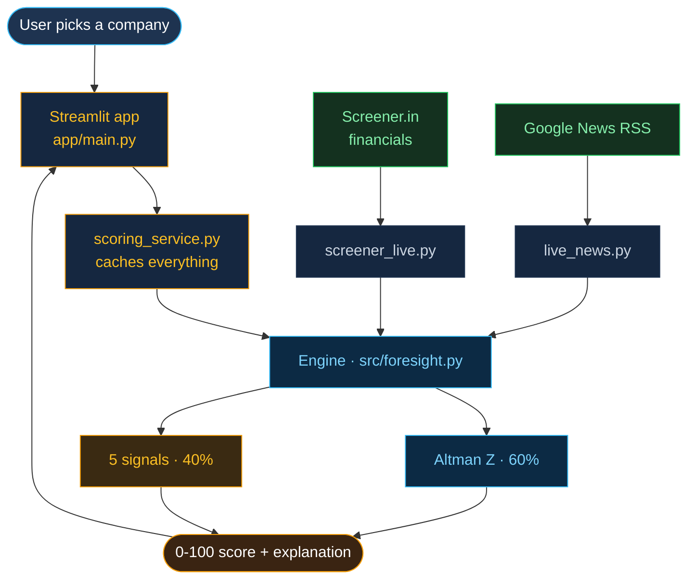
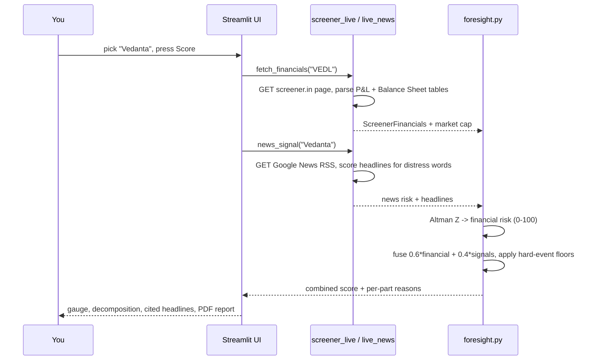
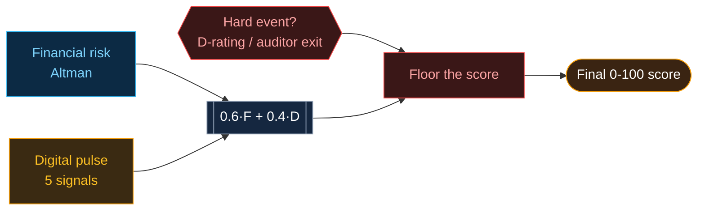

<p align="center"></p>

<h1 align="center">Foresight AI - The Complete Technical Guide</h1>

<p align="center"><i>Everything about this project, explained from zero. No prior knowledge assumed.</i></p>

---

## 0. How to read this

You do not need to know finance or machine learning. This guide starts from "what is this thing" and ends with hard interview questions. Read top to bottom once; keep §13 (the Q&A bank) open during your presentation.

---

## 1. What is Foresight AI? (in one breath)

**It is a website that gives any listed Indian company a single risk score from 0 (healthy) to 100 (about to collapse), and explains why.** It does this by combining the company's *financial health* (from its accounts) with *market signals* (news, credit ratings, who is quitting the board, hiring, employee mood). The whole thing runs live in the browser - you type a company, it fetches the data from the internet and scores it in a few seconds.

**The one-line pitch:** *Altman tells you what the balance sheet already knows; Foresight AI tells you what deserves your attention now.*

---

## 2. The technical summary (one paragraph)

Foresight AI is a **Python + Streamlit** web app. Its engine (`src/foresight.py`) computes the **Altman Z-Score** (a 1968 bankruptcy formula) from a company's financials, converts it to a 0-100 "financial risk", and **fuses** it (60%) with a **40% "digital pulse"** built from five market signals. Financials are scraped live from **Screener.in** (`requests` + `pandas.read_html`) and news from **Google News RSS** (`requests` + a keyword lexicon). Charts are **Plotly**. Separately, benchmark ML models (**LightGBM / XGBoost**, calibrated, trained on public bankruptcy datasets) were built and evaluated in `notebooks/` - but they are **research, not the live scorer**; the honest finding is that they *match* Altman rather than beat it, so the trusted linear formula stays the anchor.

---

## 3. The big picture (architecture)



**Plain English:** the app is the front door; `scoring_service` is a caching layer so nothing is recomputed needlessly; `foresight.py` is the brain; two small files go to the internet to fetch data.

---

## 4. End-to-end: what happens when you score a company



**Step by step (the tracked companies use pre-loaded signals; any other NSE name is scored live):**
1. You choose a company and press **Score**.
2. The app calls `fetch_financials(ticker)` -> downloads the Screener page and reads the **Profit & Loss**, **Balance Sheet**, and **Ratios** tables.
3. It calls `news_signal(name)` -> downloads recent Google News headlines and scores them.
4. The engine computes the **Altman Z**, turns it into a 0-100 **financial risk**, computes the **signal risks**, and **fuses** them.
5. **Hard events** (a rating cut to default, an auditor exit) *floor* the score - they cannot be averaged away.
6. The UI shows the gauge, the Altman breakdown, the cited headlines, and a downloadable PDF.

---

## 5. Where the data comes from and how it is fetched

### 5a. Financials - Screener.in (`src/screener_live.py`)
- One HTTP `GET` per company (`requests`), pretending to be a browser (User-Agent header).
- Finds the `profit-loss`, `balance-sheet`, `ratios` HTML `<section>`s with a regex, then **`pandas.read_html`** turns each `<table>` into a DataFrame.
- Pulls the **latest fiscal year** column (`Mar YYYY`) and reads Sales, Expenses, Operating Profit, Interest, Net Profit, Equity, Reserves, Borrowings, Total Assets, etc.
- **Market cap** is read from the top ratios block (needed for one Altman term).
- This is a single on-demand fetch, not bulk scraping. A production system would use a licensed feed.

### 5b. News - Google News RSS (`src/live_news.py`)
- `GET` the Google News RSS search feed for the company (no API key needed).
- Drop noise (pure "share price" headlines), then classify each headline with a **distress-keyword lexicon**: strong-negative words (`default, insolvency, NCLT, fraud, downgrade, resign, layoff...`), weak-negative, positive.
- Risk = **share of directional headlines that are negative** (not a simple average, so a few bad ones are not diluted). A strong distress word **floors** the news risk.

### 5c. Curated signals (the six tracked companies)
For six demo companies (SpiceJet, Ola Electric, Vodafone Idea, Vedanta, Paytm, TCS) the five signals are hand-entered from public reporting (dated leadership events, real rating actions, headcount, employee ratings) so the full multi-signal experience always works, even offline.

### 5d. Datasets (used to build/test the ML models)
- `data/raw/*.arff` - the **Polish companies bankruptcy** dataset (~10k firms, 64 ratios, 5 horizons) - a public benchmark.
- `data/indian/companies.csv` - **21 Indian firms** (healthy + failed) with real line items.
- `data/indian/nclt_cases.csv` - insolvency (NCLT) case labels.

---

## 6. The scoring engine (the heart, `src/foresight.py`)

### 6a. The Altman Z-Score (ELI5)
In 1968, Edward Altman found that **five financial ratios**, weighted and added up, predict bankruptcy well. Foresight uses the **original Z** for listed firms:

```
Z = 1.2·(Working capital/Assets) + 1.4·(Retained earnings/Assets)
  + 3.3·(EBIT/Assets) + 0.6·(Market value of equity/Liabilities) + 1.0·(Sales/Assets)
```

- **Z > 2.99** -> Safe · **1.81-2.99** -> Grey (watch) · **< 1.81** -> Distress.
- Each term is a health check: liquidity, accumulated profit, operating profitability, market cushion, and asset efficiency.

### 6b. Turning Z into a 0-100 risk
A higher Z means safer, but people read "risk out of 100" more easily, so Z is mapped onto 0-100 (roughly: Z 2.99 -> 25, 2.40 -> 50, 1.81 -> 75). Higher number = more risk.

### 6c. The five market signals (the "digital pulse")
Each signal is itself scored 0-100, then combined by reliability weight:

| Signal | Weight | What it reads |
|--------|:------:|---------------|
| **Credit rating** | 0.30 | latest rating (AAA...D); a **D floors the score** |
| **Leadership / board** | 0.25 | dated exits; CFO/auditor/whole-board weighted highest |
| **News sentiment** | 0.25 | share of recent headlines that are negative |
| **Hiring** | 0.10 | headcount rising or falling |
| **Employee confidence** | 0.10 | review-platform rating trend |

Missing signals are dropped and the remaining weights **re-normalised**, so a company with no rating is not unfairly penalised.

### 6d. Fusion (the final number)
```
Comprehensive risk = 0.60 × financial risk (Altman)  +  0.40 × digital pulse
```

### 6e. Hard-event floor (the safety rule)
A **verified fact** - rating at "D", an auditor resigning, a tribunal taking over the board - sets a **minimum** score that softer signals cannot pull down. Why: a news model can misread "NCLT stays insolvency plea" as *positive*; facts must beat tone. This mirrors how a real credit desk treats a covenant breach.



---

## 7. The machine-learning models (what exists vs what runs live)

**Important for questions:** the live score is **not** an ML black box - it is Altman + signals. The ML work is *evidence* that this was the right choice.

- **What was built** (`notebooks/`, `src/foresight.py` training functions): **LightGBM** and **XGBoost** gradient-boosted trees, tuned with **Optuna**, **calibrated** (`CalibratedClassifierCV`) so predicted probabilities are trustworthy, evaluated with **AUC-ROC** and **AUC-PR** on **stratified 5-fold cross-validation** (never plain accuracy, because distress is rare). **SMOTE** (imbalanced-learn) was tested and *rejected* - it invented balance sheets that do not exist and hurt PR-AUC.
- **India model:** a simple **logistic regression** on the four Altman ratios, trained on the Indian set - it scores 6/6 on the demo companies.
- **The honest finding:** models trained on **foreign** bankruptcy data (Polish, Taiwanese) **do not transfer** to Indian balance sheets, and the India-trained model only **matches** Altman. So the transparent, trusted linear Altman formula is kept as the anchor; the ML lives on as a benchmark. Artifacts sit in `models/` (`distress_model.joblib`, calibration + Optuna JSON).

---

## 8. Track Record - how the proof chart is built (people will ask)

Each of the five real cases (Unitech, Future Retail, Reliance Communications, Jaiprakash Associates, Suzlon) is scored on its **real historical financials pulled from Screener** (`data/indian/backtest_trajectory.py` fetches every past year and runs the same Altman engine). That gives the **blue Altman line** - real numbers.

The **orange "ForesightAI (comprehensive)" line** is a **reconstruction**: at each real dated event (a filing, a rating action, an arrest, a blocked deal) the combined score is placed to reflect Altman **plus** the signal risk of that moment. The **amber band** between the two is literally "the risk Altman alone could not see"; a **green band** appears when signals *cleared* risk before the accounts did (Suzlon's recovery). The dotted line is the **indexed annual share price** for context. This is stated openly on the page - the Altman line is real; the comprehensive line is an illustrative reconstruction on real events.

---

## 9. The dashboard (four tabs)

| Tab | What it shows |
|-----|---------------|
| **Overview** | what the score is, why it exists, the weighted breakdown, a sample gauge |
| **Live Company Scoring** | pick a company; tracked names show all five signals, any other NSE name is fetched + scored live |
| **Portfolio** | build a watch-list; add/remove any company; ranked worst-risk first |
| **Track Record** | the dual-line proof chart described in §8 |

---

## 10. Tech stack and libraries

| Library | Used for |
|---------|----------|
| **streamlit** | the web app / UI |
| **plotly** | all interactive charts |
| **pandas / numpy** | reading tables, all the number crunching |
| **requests** | fetching Screener pages and Google News |
| **lxml** | HTML parsing backend for `pandas.read_html` |
| **scikit-learn** | logistic model, calibration, cross-validation, metrics |
| **imbalanced-learn** | the SMOTE experiment (rejected) |
| **reportlab** | the downloadable PDF report |
| **lightgbm / xgboost / optuna / shap** | benchmark models + tuning + explanations (notebooks only) |
| **transformers / torch** | optional FinBERT news sentiment (heavy; the app defaults to the fast lexicon) |

**Runs with:** `pip install -r requirements.txt` then `streamlit run app/main.py`. Deployed free on **Streamlit Community Cloud**.

---

## 11. File-by-file map

```
app/main.py            the whole dashboard (tabs, charts, Track Record)
app/scoring_service.py caching layer (so scores/news are computed once)
app/theme.py           colours and CSS
src/foresight.py       THE ENGINE - Altman, 5 signals, fusion, floors, ML benchmarks
src/screener_live.py   live financials from Screener
src/live_news.py       live news sentiment from Google News
data/indian/           Indian training set, NCLT labels, historical backtest script
data/raw/              Polish bankruptcy benchmark (.arff)
models/                saved benchmark model + calibration
notebooks/             the model-building & evaluation story
deck/ForesightAI.pptx  the 5-slide pitch deck (+ build_deck.js that generates it)
REPORT.md              the formal project report
UNDERSTANDING.md       this guide
```

---

## 12. Known limitations (say these confidently before you are asked)

- The comprehensive **Track Record line is a reconstruction** on real events, not a live backtest of the signal engine year by year.
- **Live signals** (rating/leadership/etc.) are curated for six names; live fetch covers financials + news only.
- **Screener/Google News** are public sources; they can rate-limit or block cloud IPs. Production would use licensed feeds.
- Altman Z is unreliable for **banks/NBFCs** (financial firms) - by design we validate on non-financial companies.
- Share-price lines are **indexed annual closes** - direction, not exact rupees.

---

## 13. Question bank (with answers)

### Easy
- **Q: What does the score mean?** 0 = healthy, 100 = high distress risk. It blends financial health with market signals.
- **Q: Where does the data come from?** Financials from Screener.in, news from Google News - fetched live.
- **Q: What is the Altman Z-Score?** A 1968 formula that combines five financial ratios to flag bankruptcy risk.
- **Q: Is it live?** Yes - pick any NSE company and it fetches and scores on the spot.

### Medium
- **Q: How do you combine the signals?** 60% Altman + 40% a weighted average of five signals (rating, leadership, news, hiring, employee), re-normalised for missing data.
- **Q: Why not just use Altman?** Altman only reads the annual accounts. Signals like a rating cut or an auditor exit move earlier and cover what the balance sheet misses.
- **Q: What is a "hard event"?** A verified fact (rating "D", auditor exit, board takeover) that sets a floor the softer signals cannot pull below.
- **Q: How is news scored?** By the share of recent headlines carrying distress words, floored when a strong distress word appears - not a naive average.

### Hard
- **Q: Do you claim to beat Altman?** No. Our financial leg *is* Altman. The value is comprehensiveness, live scoring, explainability and historical validation.
- **Q: Why not a trained ML model as the scorer?** We built and calibrated LightGBM/XGBoost and tested SMOTE. Foreign data does not transfer to Indian firms and an India-trained model only matches Altman - so a transparent linear model is the honest, defensible anchor.
- **Q: Why AUC-PR, not accuracy?** Distress is rare; accuracy is misleading (predicting "all safe" scores high). Precision-Recall AUC measures how well we rank the rare distressed firms.
- **Q: Is the Track Record a real backtest?** The Altman line is real (recomputed on each year's real financials). The comprehensive line is an honest reconstruction on real dated events - we state this openly.
- **Q: Biggest weakness?** Curated signals for the tracked set and a reconstructed comprehensive history; the next step is live signal feeds and a true year-by-year signal backtest.

---

## 14. 60-second demo script

1. **Overview** - "One 0-100 score, six inputs, fully explained."
2. **Live Company Scoring** - score a company live; open the Altman breakdown and the cited headlines.
3. **Track Record** - "Blue is Altman alone; the amber band is the risk only the signals saw. Unitech read Safe for years while its promoters were arrested."
4. **Portfolio** - add a couple of names; show worst-risk-first ranking.
5. Close: *"Screener tells you what happened. Foresight AI tells you what deserves your attention."*
